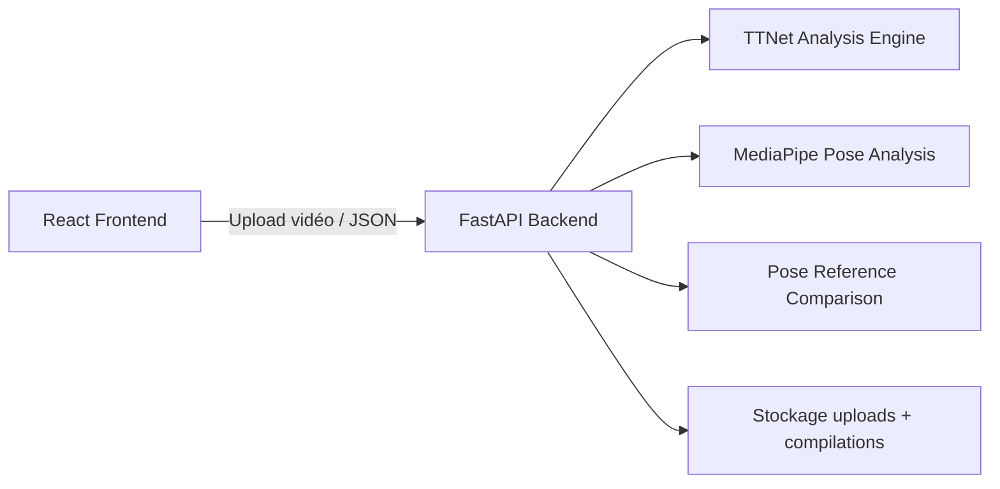

# PingPro MVP

Application web d'analyse vidéo de tennis de table par intelligence artificielle.

Cette version est un **MVP fonctionnel** concentré sur le workflow essentiel :
**upload vidéo → analyse TTNet → dashboard de résultats**.

Les modules temps réel, streaming et WebSocket ont été retirés pour simplifier le déploiement cloud.

---

## Fonctionnalités

- Upload de vidéos de tennis de table (MP4, AVI, MOV, MKV).
- Analyse automatique par TTNet (détection de la balle, échanges, services, impacts).
- **Analyse de pose avec MediaPipe Pose** :
  - Landmarks 3D du joueur.
  - Angles articulaires au contact (coude, genou, hanche, etc.).
  - Détection des phases du geste (armé, frappe, accompagnement).
  - Chaîne cinétique (bassin → épaules → avant-bras).
  - Comparaison avec un modèle de référence (DTW).
- Dashboard interactif avec les onglets :
  - Match compilé, points forts/faibles, meilleurs échanges, impacts balle.
  - **Coach IA Pose** : angles, squelette 2D, vue 3D interactive, comparaison, rapport.
- Génération de compilations vidéo (si FFmpeg est disponible).
- Score de match estimé selon les règles du tennis de table.
- Rapport de pose généré par LLM ou fallback statique.
- Aucune dépendance externe obligatoire : MongoDB et les clés API sont optionnelles.

---

## Architecture



- **Frontend** : React 19, Create React App, Tailwind CSS, shadcn/ui, Recharts, Three.js / React Three Fiber.
- **Backend** : FastAPI + Uvicorn, OpenCV, MediaPipe, NumPy, scikit-learn, SciPy, PyTorch (CPU).
- **Stockage** : en mémoire par défaut, MongoDB en option.

---

## Prérequis

- Python **3.11 ou 3.12** recommandé (Python 3.14+ n'est pas supporté par toutes les dépendances scientifiques).
- Node.js **20+**.
- Yarn.
- FFmpeg (optionnel, pour les compilations vidéo).

> **Note Python 3.14** : si vous souhaitez conserver Python 3.14, commencez par tester l'interface en mode démo (voir ci-dessous) pendant que les dépendances backend sont ajustées.

---

## Installation locale

### 1. Cloner le dépôt

```bash
git clone https://github.com/Fonipanda/PingPro.git
cd PingPro
```

### 2. Configurer le backend

```bash
cd backend
cp .env.example .env
python -m venv venv
# Windows
venv\Scripts\pip install -r requirements.txt
# macOS/Linux
source venv/bin/activate
pip install -r requirements.txt
```

### 3. Configurer le frontend

```bash
cd ../frontend
cp .env.example .env
yarn install
```

### 4. Lancer l'application

Dans un terminal, démarrer le backend :

```bash
cd backend
# Windows
venv\Scripts\python -m uvicorn server:app --host 0.0.0.0 --port 8000 --reload
# macOS/Linux
source venv/bin/activate
python -m uvicorn server:app --host 0.0.0.0 --port 8000 --reload
```

Dans un autre terminal, démarrer le frontend :

```bash
cd frontend
yarn start
```

Ouvrir [http://localhost:3000](http://localhost:3000).

---

## Tester l'interface sans backend (mode démo)

Si le backend n'est pas encore installé (par exemple avec Python 3.14), vous pouvez tester le frontend avec des données factices :

```bash
cd frontend
cp .env.development .env
yarn start
```

Puis, sur la page d'accueil, cliquez sur **Activer le mode démo** et sur **Lancer la démo**. L'analyse complète s'affiche, y compris l'onglet **Coach IA Pose**, sans aucun appel au backend.

Vous pouvez aussi activer le mode démo sans modifier `.env` en ajoutant `?mock=1` dans l'URL :

```
http://localhost:3000/?mock=1
```

---

## Configuration

### Variables d'environnement backend (`backend/.env`)

| Variable | Description | Obligatoire |
|---|---|---|
| `CORS_ORIGINS` | Origines CORS autorisées, séparées par des virgules. Défaut : `*`. | Non |
| `MONGO_URL` | URL de connexion MongoDB. Si absent, stockage en mémoire. | Non |
| `DB_NAME` | Nom de la base MongoDB. Défaut : `pingpro`. | Non |
|| `OPENAI_API_KEY` | Clé API OpenAI pour les rapports de pose. Si absente, fallback statique. | Non |

### Variables d'environnement frontend (`frontend/.env`)

| Variable | Description | Exemple |
|---|---|---|
| `REACT_APP_BACKEND_URL` | URL de l'API backend. | `http://localhost:8000` |
| `REACT_APP_MOCK_MODE` | Active le mode démo sans backend. | `true` ou `false` |

---

## Déploiement cloud

### Docker Compose (recommandé)

```bash
docker compose up --build
```

- Frontend : [http://localhost:3000](http://localhost:3000)
- Backend API : [http://localhost:8000/api](http://localhost:8000/api)

### Déploiement manuel sur un VPS

1. Installer Docker et Docker Compose sur le serveur.
2. Copier les fichiers du projet.
3. Adapter les variables d'environnement dans `docker-compose.yml` et `frontend/.env`.
4. Lancer `docker compose up -d`.
5. Configurer un reverse proxy (nginx, Traefik, Caddy) avec HTTPS.

### Services cloud compatibles

- Railway
- Render
- Fly.io
- Hetzner, DigitalOcean, AWS, GCP, Azure

> **Note** : les plateformes sans persistance de disque perdront les résultats en mémoire au redémarrage. Pour la production, activez MongoDB.

---

## API Endpoints

| Méthode | Endpoint | Description |
|---|---|---|
| POST | `/api/analyze` | Uploader une vidéo et lancer l'analyse. |
| GET | `/api/analysis/{id}/status` | Récupérer le statut de l'analyse. |
| GET | `/api/analysis/{id}/results` | Récupérer les résultats complets (TTNet + pose). |
| GET | `/api/analysis/{id}/video/{type}` | Télécharger une compilation vidéo. |
| GET | `/api/analysis/{id}/pose/frame/{index}` | Récupérer une image overlay de pose. |
| GET | `/api/` | Message de santé de l'API. |

---

## Limites connues du MVP

- Pas de persistance par défaut : les analyses sont stockées en mémoire.
- L'analyse TTNet est heuristique et ne remplace pas un modèle entraîné sur des vidéos réelles de tennis de table.
- L'analyse de pose nécessite que le joueur soit visible et correctement cadré (main, hanches et jambes visibles).
- Le modèle de référence pour la comparaison de coups est synthétique et limité à quelques coups de base.
- Les compilations vidéo nécessitent FFmpeg.
- L'intégration LLM est désactivée si aucune clé API n'est fournie.
- Les modules temps réel et streaming ont été supprimés.

---

## Scripts de test

Backend :

```bash
cd backend
python -m uvicorn server:app --host 127.0.0.1 --port 8000
```

Frontend :

```bash
cd frontend
yarn build
yarn test
```

---

## Structure du projet

```
PingPro/
├── backend/
│   ├── server.py              # API FastAPI principale
│   ├── ttnet_analysis.py      # Analyse TTNet
│   ├── pose_analysis.py       # Analyse de pose MediaPipe
│   ├── pose_reference.py      # Comparaison avec modèle de référence
│   ├── video_processor.py     # Traitement vidéo et détection d'échanges
│   ├── requirements.txt
│   ├── Dockerfile
│   └── .env.example
├── frontend/
│   ├── src/
│   │   ├── App.js             # Application React
│   │   └── PoseAnalysis.js    # Dashboard Coach IA Pose
│   ├── package.json
│   ├── Dockerfile
│   ├── nginx.conf
│   └── .env.example
├── docker-compose.yml
└── README.md
```

---

## Licence

Projet issu du dépôt [Fonipanda/PingPro](https://github.com/Fonipanda/PingPro).
